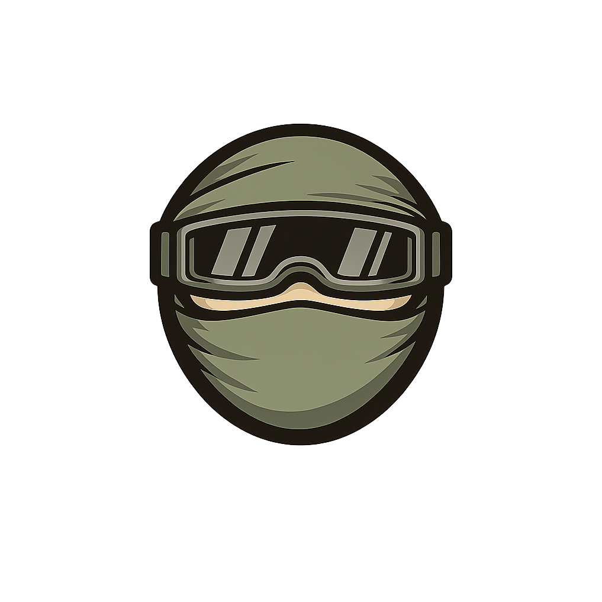

<p align="center">
  
</p>

<h1 align="center">agent-vis</h1>

<p align="center">A local viewer for Claude Code and Codex sessions. Watch agent activity in real time — patches, shell commands, reasoning, token usage — and interact with running sessions from your browser.</p>

<p align="center">
  <a href="https://youtu.be/MVc9ljH8y4A">
    
  </a>
</p>

<br />

When you hand off work to an AI agent you're still accountable for everything it produces. agent-vis gives you ambient visibility into what your agent is doing without interrupting it — open it in a browser tab while the agent runs in a terminal, and stay oriented in real time without scrolling through output or waiting for a commit to review.

## Features

- **Session timeline** — all events in reverse-chronological order: file patches, shell commands, user/agent messages, reasoning, token usage; click any entry to expand
- **File tree** — changed files grouped by directory with add/modify/delete indicators; click any file to jump to its diff
- **Files graph** — playing-card stacks of file changes laid out as a canvas, with bezier edges showing import relationships between files; minimap for navigation
- **Terminal** — embedded terminal that resumes the session's Claude Code conversation in its working directory
- **AI explain** — explain a diff with Anthropic, OpenRouter, or a local OpenAI-compatible model (Ollama / LM Studio)
- **Settings** — configure the explain model, credentials, and optional Tailscale access from the app

## Install

Requires Node.js 18+. **macOS and Linux only** — Windows is not supported.

```bash
git clone https://github.com/whywont/agent-vis
cd agent-vis
npm install
npm run dev
```

Open [http://localhost:3333](http://localhost:3333).

Sessions are read directly from `~/.claude/projects/` (Claude Code) and `~/.codex/sessions/` (Codex). Nothing is copied or stored.

## Docker (Windows / Linux servers) (In Progress, Not Working)

Docker lets you run agent-vis on Windows by mounting your session directories into the container. The Terminal tab is automatically disabled inside Docker.

```bash
docker build -t agent-vis .
docker run -p 3333:3333 \
  -v ~/.claude/projects:/root/.claude/projects:ro \
  -v ~/.codex/sessions:/root/.codex/sessions:ro \
  agent-vis
```

Open [http://localhost:3333](http://localhost:3333).

**On Windows with WSL2** — Claude Code and Codex sessions live inside your WSL2 distro, so run the command from a WSL2 terminal (not PowerShell) so `~` resolves to the right place.

To pass an API key for the AI explain feature:

```bash
docker run -p 3333:3333 \
  -v ~/.claude/projects:/root/.claude/projects:ro \
  -v ~/.codex/sessions:/root/.codex/sessions:ro \
  -e ANTHROPIC_API_KEY=your_key_here \
  agent-vis
```

## Explain models and Settings

The **Settings** page (gear icon) configures the model behind each diff's **explain** button. It does **not** change the model running your Claude Code or Codex session.

Anthropic Haiku (`claude-haiku-4-5`) is the default explain model, chosen for quick, inexpensive summaries. You can instead use OpenRouter (for example, Gemini Flash Lite) or a local Ollama / LM Studio model. The rest of agent-vis works without any model key.

Settings are saved in `.env.local`. Credentials are never returned to the browser after saving: the UI shows only whether one is saved, lets a blank field keep it, accepts a new value to replace it, and offers explicit removal. `.env.local` is gitignored, so it is not committed to GitHub.

You can configure this in Settings, or create the file yourself:

```bash
cp .env.example .env.local
```

```env
# Anthropic: default explain provider
ANTHROPIC_API_KEY=your_key_here

# OpenRouter: inexpensive hosted explain models
# AGENT_VIS_EXPLAIN_PROVIDER=openrouter
# AGENT_VIS_EXPLAIN_MODEL=google/gemini-2.5-flash-lite
# OPENROUTER_API_KEY=your_key_here

# Local: Ollama's default OpenAI-compatible endpoint
# AGENT_VIS_EXPLAIN_PROVIDER=openai-compatible
# AGENT_VIS_EXPLAIN_MODEL=qwen3-coder:30b
# AGENT_VIS_LOCAL_BASE_URL=http://127.0.0.1:11434/v1
# AGENT_VIS_LOCAL_API_KEY=
```

`AGENT_VIS_LOCAL_BASE_URL=http://127.0.0.1:11434/v1` contains no secret: `127.0.0.1` points only at Ollama running on the same Mac. For LM Studio, enable its OpenAI-compatible server and enter its local server URL instead.

OpenRouter's model catalog and Anthropic keys are hosted services; local Ollama / LM Studio explains use your Mac's RAM and work without an internet connection once the model is downloaded.

## Tailscale Access

agent-vis is local-only by default. To access it from a phone over Tailscale, bind it to your Mac's Tailscale IP and require an access token.

1. Find your Mac's Tailscale IP:

```bash
tailscale ip -4
```

2. Either add these values to `.env.local`, or use **Settings → Tailscale access**:

```env
HOSTS=127.0.0.1,100.x.y.z
AGENT_VIS_AUTH_TOKEN=use-a-long-random-token
AGENT_VIS_ALLOW_REMOTE_TERMINAL=1
```

3. Restart agent-vis:

```bash
npm run dev
```

4. Open this on your phone while Tailscale is connected:

```text
http://100.x.y.z:3333/auth
```

Enter the token once. The app stores it in an HTTP-only cookie. Remote terminal access is blocked unless both `AGENT_VIS_AUTH_TOKEN` and `AGENT_VIS_ALLOW_REMOTE_TERMINAL=1` are set.

Using `HOSTS=127.0.0.1,100.x.y.z` keeps normal Mac access at `http://localhost:3333` while exposing only the Tailscale interface to your phone. Avoid `HOST=0.0.0.0` unless you intentionally want LAN devices to reach the app too.

## Notes

- The server binds to `127.0.0.1` by default and is not accessible from other machines
- Binding to a non-local host without `AGENT_VIS_AUTH_TOKEN` is refused at startup
- On macOS, `node-pty`'s spawn-helper is fixed automatically by the `postinstall` script
